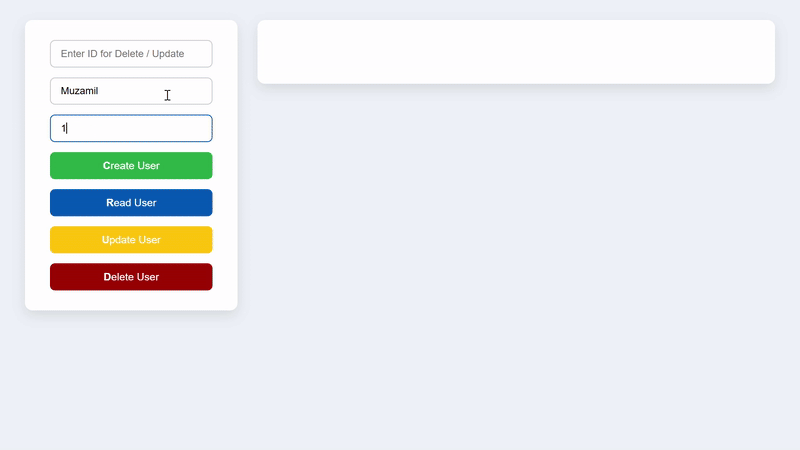
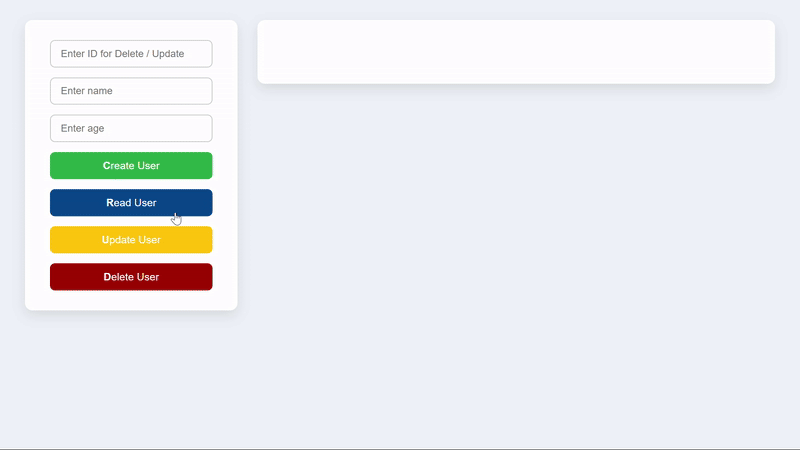
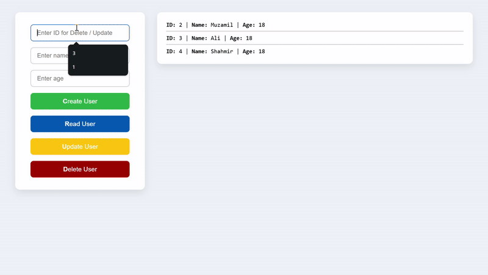
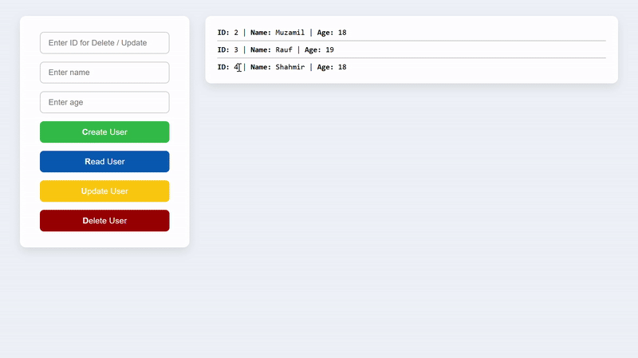

# 🚀 FastAPI + SQLite3 CRUD API (Dockerized)

A clean and modern backend project built with:

- 🔥 **FastAPI** for powerful API handling
- 🧠 **Pydantic** for data validation
- 🗃️ **SQLite3** as a simple embedded database
- 🐳 **Docker** to run it anywhere
- 🌐 **Frontend (HTML + JS)** for interacting with the API in real time

---

## 📦 Features

- Full CRUD operations (Create, Read, Update, Delete)
- User model with `name` and `age` fields
- SQLite database created on first run
- Cross-origin requests allowed (CORS ready for frontend)
- Beautiful frontend interface using plain HTML + JavaScript
- Dockerized backend — runs with one command

---

## 🎬 CRUD Operation Previews

Here’s a visual walkthrough of each core operation in the app:

---

### 🟢 Create User

<p align="center">
  
</p>

---

### 🔵 Read Users

<p align="center">
  
</p>

---

### 🟡 Update User

<p align="center">
  
</p>

---

### 🔴 Delete User

<p align="center">
  
</p>

---


## 🧪 API Endpoints

| Method | Endpoint                  | Description                  |
|--------|---------------------------|------------------------------|
| POST   | `/response/`              | Create a new user            |
| GET    | `/users`                  | Get all users                |
| GET    | `/users/{id}`             | Get user by ID               |
| DELETE | `/del-user/{id}`          | Delete user by ID            |
| PUT    | `/update-user/{id}`       | Update user's name and age   |

---

## 🧑‍💻 How to Use (with Docker)

### 1. Clone the repo

```bash
git clone https://github.com/yourusername/fastapi-project.git
cd fastapi-project
```
### 2. Build the Docker image

```bash
docker build -t fastapi-backend .
docker run -d -p 8000:8000 fastapi-backend
```
### 2. Test API
Open your browser and go to: http://localhost:8000/docs


